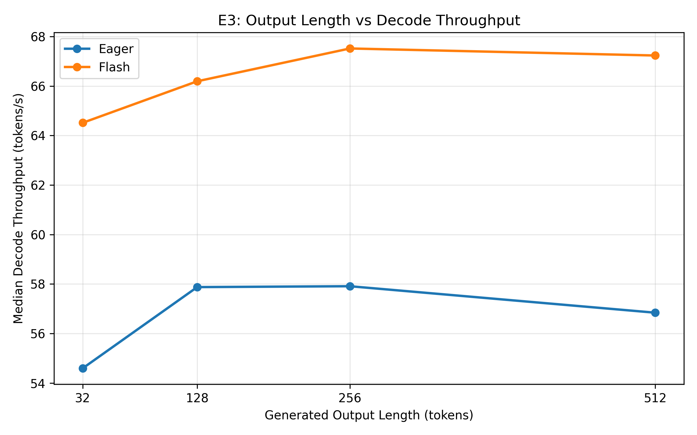
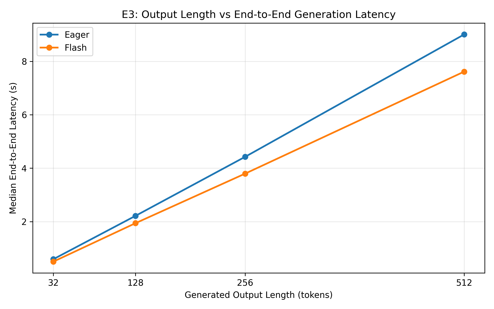
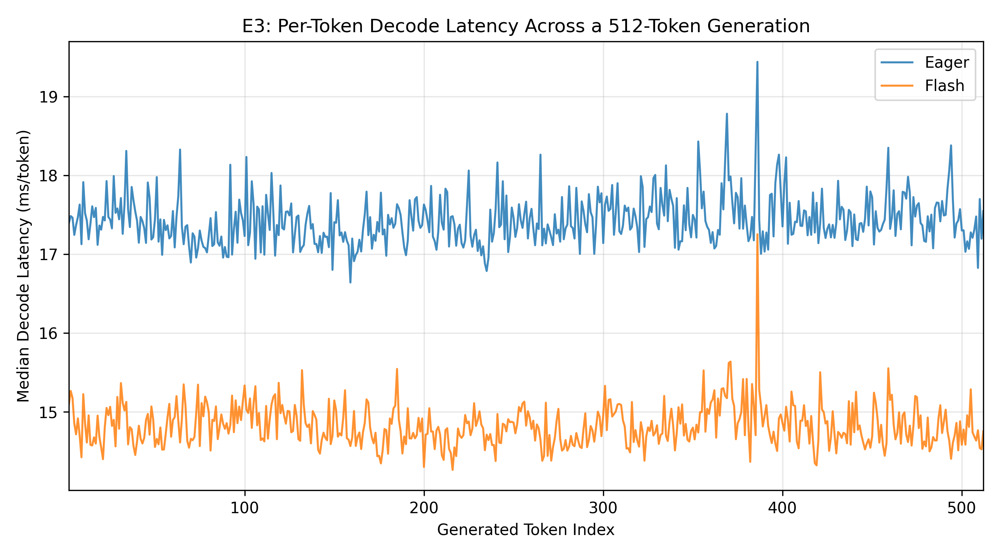

# LLM Inference Systems Performance & Optimization Lab

A hands-on GPU performance engineering project for studying **LLM inference behavior, bottlenecks, and optimization paths** using PyTorch, Hugging Face Transformers, and an NVIDIA RTX 4070.

The project focuses on controlled experiments around **prefill, attention backends, autoregressive decoding, KV-cache growth, GPU memory behavior, and profiling**.

> Current model: `Qwen/Qwen2.5-1.5B-Instruct`  
> Current GPU: NVIDIA GeForce RTX 4070 12 GB  
> Main environment: WSL2 / Ubuntu 22.04  
> Precision: FP16

---

## Project Goals

This repository investigates practical LLM inference systems questions such as:

- How does input context length affect TTFT and GPU memory?
- Why can a higher-level "optimized" attention API sometimes be slower?
- How do Eager, Math SDPA, and Flash SDPA differ in actual kernel execution?
- How does autoregressive decode scale with output length?
- How fast does KV cache grow in practice?
- Can small per-token improvements accumulate into meaningful end-to-end latency savings?
- Are local latency anomalies tied to sequence-length boundaries or system memory behavior?

The emphasis is not just on benchmark numbers, but on a workflow of:

**observe → profile → form a hypothesis → design a controlled experiment → verify**

---

## Experimental Baseline

### Baseline A

- Model: `Qwen/Qwen2.5-1.5B-Instruct`
- Framework: Hugging Face Transformers + PyTorch
- Precision: FP16
- Attention implementation: Eager
- Batch size: 1
- Single request
- KV cache enabled
- Single RTX 4070
- No quantization
- No `torch.compile`
- No vLLM
- No custom CUDA/Triton kernels
- No multi-GPU parallelism

Baseline A is intentionally simple and acts as the controlled reference implementation.

---

## Completed Experiments

### E1 — Context-Length Scaling

**Goal:** Measure how increasing input context length affects prefill/TTFT, throughput, and GPU memory.

Input lengths:

`128 / 256 / 512 / 1024 / 2048 / 4096`

Key observations:

- Context length increased by 32× from 128 to 4096 tokens.
- TTFT increased from about **32 ms to 936 ms**.
- End-to-end throughput decreased from about **39.2 tok/s to 29.7 tok/s**.
- Peak allocated GPU memory increased from about **2.90 GB to 4.89 GB**.
- The TTFT curve became much steeper beyond roughly 1024 tokens.

This established long-context prefill as a major performance bottleneck.

---

### E2 — Attention Backend Investigation

**Goal:** Explain the long-context prefill bottleneck and compare attention execution paths.

At 4096 input tokens:

| Backend / Environment | Median Prefill | Peak Allocated Memory |
|---|---:|---:|
| Eager | ~598 ms | ~4.60 GB |
| SDPA Math | ~927 ms | ~4.89 GB |
| SDPA Flash | ~285–286 ms | ~4.17 GB |

Key findings:

- Native Windows SDPA Auto behaved approximately like the Math backend in the tested environment.
- Forced Flash SDPA was unavailable on native Windows in this setup.
- Under WSL/Linux, SDPA Auto behaved approximately like Flash.
- Flash was about **2.09× faster than Eager**.
- Flash was about **3.24× faster than Math**.
- Flash used about **15% less peak allocated GPU memory than Math**.

Profiler analysis showed:

- Math SDPA explicitly materialized large `N × N` attention intermediates and executed separate QKᵀ, masking, softmax, and AV operations.
- Flash SDPA executed `pytorch_flash::flash_fwd_kernel` without standalone full `N × N` softmax/BMM operations.
- FFN GEMM costs were similar between Math and Flash, indicating that the performance gap primarily came from the attention path.

> Note: "Flash" in this project means the **PyTorch SDPA Flash backend**, not the external `flash-attn` package.

---

### E3 — Autoregressive Decode Scaling

**Goal:** Measure true per-token decode behavior instead of estimating TPOT from total generation time.

Configuration:

- Input length: 128 tokens
- Output lengths: `32 / 128 / 256 / 512`
- Warm-up runs: 2
- Measured runs: 5
- Backends: Eager and SDPA Flash
- Manual autoregressive loop
- Per-token timing with CUDA Events

#### Results

| Backend | Output | Mean TPOT | P95 TPOT | Decode Throughput | E2E Latency |
|---|---:|---:|---:|---:|---:|
| Eager | 32 | 18.36 ms | 20.77 ms | 54.59 tok/s | 0.591 s |
| Eager | 128 | 17.25 ms | 18.22 ms | 57.88 tok/s | 2.215 s |
| Eager | 256 | 17.25 ms | 18.24 ms | 57.91 tok/s | 4.425 s |
| Eager | 512 | 17.58 ms | 18.84 ms | 56.84 tok/s | 9.012 s |
| Flash | 32 | 15.80 ms | 19.62 ms | 64.51 tok/s | 0.499 s |
| Flash | 128 | 15.26 ms | 16.60 ms | 66.19 tok/s | 1.940 s |
| Flash | 256 | 14.84 ms | 15.77 ms | 67.52 tok/s | 3.796 s |
| Flash | 512 | 14.88 ms | 15.83 ms | 67.23 tok/s | 7.619 s |

Key findings:

- Total decode latency scaled approximately linearly with output length.
- TPOT remained broadly stable through the tested total sequence range of about 640 tokens.
- Flash improved decode throughput by roughly **14–18%**.
- The decode improvement was much smaller than the long-context prefill improvement seen in E2.
- At 512 output tokens, Flash reduced E2E latency by about **1.39 seconds**.

---

### KV-Cache Validation

Measured persistent GPU-memory growth closely matched the theoretical FP16 KV-cache growth.

For this model:

```text
28 layers
× 2 KV heads
× 128 head dimension
× 2 tensors (K + V)
× 2 bytes
= 28 KiB/token
```

For approximately 511 additional cached decode tokens:

```text
511 × 28 KiB ≈ 13.97 MiB
```

Measured persistent memory growth was approximately:

```text
13.98 MiB
```

The close agreement provides an experimental validation of the theoretical KV-cache footprint.

Flash and Eager showed nearly identical persistent KV-cache memory usage, so the Flash decode speedup is **not** due to KV-cache compression.

---

### E3B — 512-Token Sequence-Boundary Verification

During E3, a repeatable local latency spike appeared around generated token #386.

Because the prompt length was 128 tokens:

```text
128 + 386 - 1 = 513
```

This suggested that the anomaly might be associated with crossing the cached sequence boundary from 512 to 513 tokens.

E3B tested this hypothesis by changing the prompt length while keeping the output workload large enough to cross the same effective sequence length.

| Prompt Length | Spike Token | Effective Sequence Length | Latency @ 512 | Latency @ 513 |
|---:|---:|---:|---:|---:|
| 64 | #450 | 513 | ~14.23 ms | ~16.76 ms |
| 128 | #386 | 513 | ~14.51 ms | ~16.85 ms |
| 256 | #258 | 513 | ~14.47 ms | ~16.06 ms |

The generated-token position moved as the prompt length changed, but the spike consistently aligned with:

```text
effective sequence length = 513
```

This strongly suggests a reproducible **sequence-length boundary effect**, rather than a special property of a fixed generated-token index.

#### Memory behavior at the same boundary

CUDA reserved memory also increased around the 512 → 513 boundary:

| Prompt Length | Reserved @ 512 | Reserved @ 513 | Change |
|---:|---:|---:|---:|
| 64 | 3180 MiB | 3186 MiB | +6 MiB |
| 128 | 3196 MiB | 3202 MiB | +6 MiB |
| 256 | 3258 MiB | 3262 MiB | +4 MiB |

At the same time, persistent allocated memory continued to grow smoothly at approximately the expected KV-cache rate.

Therefore, the current conclusion is:

> A reproducible sequence-length boundary effect was observed when the cached sequence crossed approximately 512 tokens. The latency spike coincided with an increase in CUDA reserved memory, while persistent allocated memory continued to grow smoothly.

This is a correlation, not yet a proven causal mechanism. A future operator-level profiler comparison around sequence lengths 512 and 513 could help identify the exact source.

---

## Result Figures

### Decode Throughput



### End-to-End Generation Latency



### Per-Token Decode Latency



---

## Repository Structure

```text
llm-inference-systems-lab/
├── src/
│   ├── baseline.py
│   ├── benchmark.py
│   ├── context_length_benchmark.py
│   ├── profiler_prefill.py
│   ├── attention_backend_benchmark.py
│   ├── profile_attention_backends.py
│   ├── sdpa_backend_diagnostic.py
│   ├── profile_sdpa_backends_linux.py
│   ├── decode_scaling_benchmark.py
│   ├── plot_decode_scaling.py
│   ├── e3b_boundary_benchmark.py
│   │
│   └── results/
│       ├── raw/
│       ├── profiler/
│       └── figures/
│           └── e3/
│
└── experiments/
```

The exact repository structure may evolve as new experiments are added.

---

## Environment

Main tested environment:

```text
OS: WSL2 / Ubuntu 22.04
Python: 3.10.12
PyTorch: 2.11.0+cu128
CUDA Runtime: 12.8
GPU: NVIDIA GeForce RTX 4070 12 GB
```

---

## Setup

Create and activate a Python virtual environment:

```bash
python3 -m venv .venv
source .venv/bin/activate
```

Install the core dependencies:

```bash
pip install torch transformers accelerate safetensors pandas matplotlib
```

Then move into the repository and run individual experiments from the project root.

Example:

```bash
python src/decode_scaling_benchmark.py
python src/plot_decode_scaling.py
```

For Linux/WSL attention backend experiments:

```bash
python src/sdpa_backend_diagnostic.py
python src/profile_sdpa_backends_linux.py
```

---

## Current Experimental Story

```text
E1 — Context Scaling
  ↓
Longer context causes rapidly increasing TTFT / prefill cost

E2 — Attention Backend Investigation
  ↓
Backend dispatch explains major performance differences
  ↓
Flash SDPA dramatically reduces long-context prefill cost

E3 — Decode Scaling
  ↓
Decode total time scales approximately linearly
  ↓
TPOT remains stable in the tested range
  ↓
Flash provides a smaller but consistent decode improvement
  ↓
Measured memory growth validates theoretical KV-cache growth

E3B — Boundary Investigation
  ↓
A local latency anomaly is isolated
  ↓
Controlled prompt-length changes verify a 512→513 sequence boundary effect
  ↓
The effect coincides with CUDA reserved-memory expansion
```

---

## Roadmap

Planned next steps:

- **Baseline R — Realistic Request Workload**
  - Short chat
  - Knowledge QA
  - Document QA
  - Long-context requests
  - Generation-heavy requests
  - TTFT / TPOT / latency percentiles / throughput

- **Precision & Quantization**
  - FP16 / BF16
  - Supported 8-bit / 4-bit configurations
  - Memory and latency trade-offs
  - Quality sanity checks

- **vLLM Serving**
  - Continuous batching
  - PagedAttention
  - Concurrency scaling
  - P50 / P95 latency
  - Requests/s and tokens/s
  - GPU-memory utilization

- **Optional multi-GPU experiments**
  - Tensor Parallelism
  - Communication overhead
  - Scaling efficiency

---

## Notes

This repository is an experimental performance-engineering project. Results are specific to the tested hardware, software stack, model, precision, and workload configuration and should not be treated as universal performance claims.

